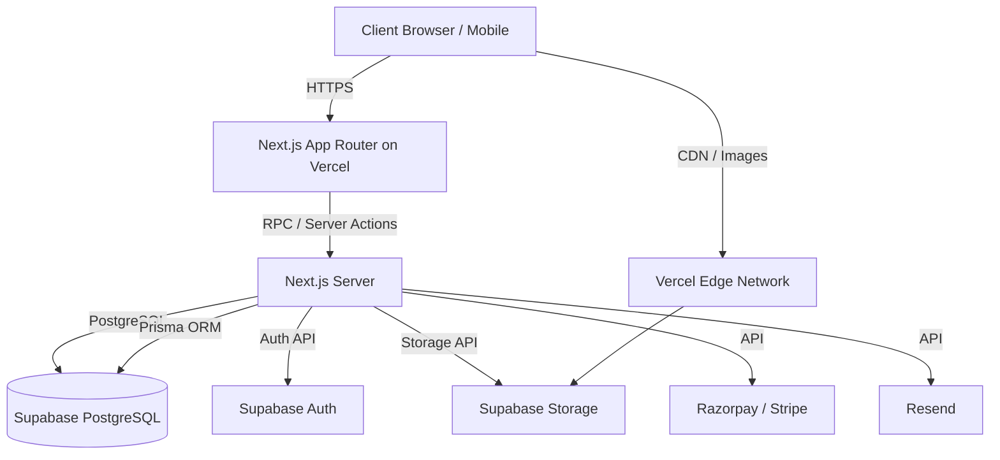

# Sterling Corporate Gifting Platform - Architecture Document

## 1. System Architecture Overview

The Sterling platform utilizes a modern, serverless architecture built around Next.js on Vercel, with Supabase providing database, authentication, and storage capabilities.



### Components
- **Frontend/Backend:** Next.js 14+ (App Router) deployed on Vercel.
- **Database:** Supabase PostgreSQL accessed via Prisma ORM.
- **Authentication:** Supabase Auth with server-side cookie management.
- **Storage:** Supabase Storage buckets for product images and assets.
- **Payments:** Razorpay (primary India), Stripe (International).
- **Email:** Resend for transactional emails.

## 2. Frontend Architecture

The frontend is built using Next.js 14 App Router, React, TypeScript, Tailwind CSS, and shadcn/ui.

### Route Groups
The application uses Next.js Route Groups to organize pages and apply layouts without affecting the URL structure:
- `(public)`: Public-facing marketing pages, product catalog, cart, and checkout.
- `(auth)`: Login, registration, password reset, and magic link flows.
- `(dashboard)`: Customer portal for managing corporate accounts, order history, address book, and invoices.
- `(admin)`: Internal admin dashboard for managing products, categories, orders, users, and content.

### Server Components vs. Client Components
- **Server Components (Default):** Used for data fetching, SEO optimization, and static rendering. Minimizes client bundle size.
- **Client Components (`'use client'`):** Used only when interactivity, state management, or browser APIs (like `localStorage` or `window`) are required (e.g., carousels, forms, complex UI interactions).

### Data Fetching Patterns
- **Server Components:** Direct database queries via Prisma for optimal performance and SEO.
- **Server Actions:** Used for form submissions and data mutations.
- **Route Handlers:** Used for webhooks and external API integrations.

### State Management
- **Local State:** React `useState` and `useReducer` for component-level state.
- **Global UI State:** React Context for UI elements like modal states or theme.
- **Cart State:** React Context combined with local storage (and synced to server for authenticated users).
- **Server State:** Relying on Next.js Cache and Revalidation mechanisms rather than complex client-side state libraries like Redux.

### Component Architecture
We follow a modified Atomic Design pattern:
- **UI (Atoms/Molecules):** Reusable UI components from shadcn/ui (buttons, inputs, cards).
- **Domain Components (Organisms):** Product cards, cart drawers, checkout forms.
- **Layouts/Templates:** Standardized page layouts (Header, Footer, Sidebar).

## 3. Backend Architecture

The backend functionality is co-located within the Next.js application using Server Actions and Route Handlers.

### API Route Structure
While most data fetching uses Server Components, external APIs and webhooks reside in `src/app/api/`:
- `/api/webhooks/stripe`: Stripe payment status updates.
- `/api/webhooks/razorpay`: Razorpay payment status updates.
- `/api/cron/*`: Scheduled tasks (e.g., abandoned cart emails).

### Server Actions
All data mutations (creates, updates, deletes) use Next.js Server Actions. These are defined in dedicated files (e.g., `src/app/actions/product.ts`) and ensure type safety end-to-end.

### Middleware
Next.js Middleware (`src/middleware.ts`) is used for:
- **Authentication:** Verifying Supabase session cookies and protecting routes.
- **Role-Based Access Control (RBAC):** Restricting access to `/admin` routes based on user role.
- **Security Headers:** Applying CSP, X-Frame-Options, etc.
- **Rate Limiting:** Basic rate limiting on sensitive routes (e.g., login, password reset).

### Service Layer Pattern
Business logic is abstracted into a service layer (`src/services/`) to keep Server Actions and Route Handlers clean.
- `ProductService`: Complex product queries, inventory checks.
- `OrderService`: Order creation, state machine transitions.
- `UserService`: User creation, profile updates.

### Error Handling Strategy
- Domain errors (e.g., "Out of stock") are returned as structured objects: `{ error: string, code: string }`.
- Unexpected errors are caught by global error boundaries and logged to a monitoring service.

## 4. Database Architecture

The primary database is a managed PostgreSQL instance provided by Supabase.

### Schema Management
- **ORM:** Prisma is used for schema definition, migrations, and type-safe querying.
- **Connection Pooling:** Utilizing Supabase's built-in PgBouncer connection pooling for serverless environments.

### Migration Strategy
- Prisma Migrations (`prisma migrate dev` / `prisma migrate deploy`) are used to manage schema changes safely across environments.

### Seeding Strategy
- A robust `prisma/seed.ts` script populates the database with essential roles, initial categories, test products, and admin users for development and staging environments.

### Core Data Models
- `User`, `Role`, `Company`, `Address`
- `Product`, `Category`, `ProductVariant`, `ProductMedia`
- `Order`, `OrderItem`, `Invoice`

## 5. Authentication Architecture

### Supabase Auth integration
- Using Supabase Auth with standard Email/Password and OAuth options (Google).
- The platform uses server-side cookie-based sessions to support SSR and Server Components.

### Session Management
- `createServerClient` from `@supabase/ssr` is used across Server Components, Server Actions, and Route Handlers to securely read and manage the session cookie.

### Route Protection (Middleware)
- The Next.js middleware inspects the session cookie. If a user attempts to access `/dashboard` or `/admin` without a valid session, they are redirected to `/login`.

### Role-Based Access Control (RBAC)
- Users are assigned roles (e.g., `CUSTOMER`, `ADMIN`, `SUPER_ADMIN`).
- Roles are synced to the `public.User` table in Prisma.
- Authorization checks are performed at the service level and in middleware.

### Corporate Multi-User Structure
- A `Company` model allows multiple `User` accounts to be linked to a single corporate entity.
- This supports shared billing, order history visibility across the company, and tiered approval workflows in the future.

## 6. Storage Architecture

### Supabase Storage
Storage buckets are used for managing all media assets:
- `products`: High-resolution product imagery.
- `brand-assets`: Logos, branding guidelines for corporate customisation.
- `uploads`: Temporary user uploads (e.g., bulk order CSVs, custom logo uploads for products).

### Image Optimization
- All images are served through the Next.js `<Image />` component.
- The `loader` is configured to optimize images fetched from Supabase Storage, delivering WebP/AVIF formats based on browser support and resizing on demand.

### File Upload Flow
1. Client requests a signed upload URL from a Server Action.
2. Server validates authorization and file constraints (size, type).
3. Client uploads the file directly to Supabase Storage using the signed URL, bypassing the Next.js server to save bandwidth and improve performance.
4. Client confirms upload via Server Action, linking the URL to a database record (e.g., `ProductMedia`).

## 7. Payment Architecture

Given the platform's B2B nature, payment workflows are more complex than typical B2C e-commerce.

### Provider Abstraction Layer
A generic `PaymentService` interface abstracts the underlying payment provider, allowing seamless switching or geographical routing.

### Integrations
- **Razorpay:** Primary gateway for domestic (Indian) corporate clients (UPI, Netbanking, Corporate Credit Cards).
- **Stripe:** Primary gateway for international clients.

### B2B Payment Workflows
- **Instant Payment:** Standard checkout flow for smaller orders.
- **Proforma Invoice / Purchase Order (PO):**
  - Customer generates a Proforma Invoice.
  - Order state is set to `PENDING_PO`.
  - Customer uploads a verified PO.
  - Admin approves the PO, order state moves to `PROCESSING`.
  - Payment is collected based on agreed credit terms (e.g., Net 30).

### Webhook Handling
Dedicated route handlers securely verify webhook signatures from Stripe/Razorpay and update order payment statuses asynchronously.

## 8. Email Architecture

Transactional emails are critical for B2B operations (invoices, PO approvals, shipping updates).

### Email Service Abstraction
An internal `EmailService` manages sending emails.

### Provider and Templates
- **Provider:** Resend is the primary transactional email provider.
- **Templates:** React Email is used to build type-safe, responsive HTML email templates using standard React components.

### Transactional Events
Key email triggers include:
- Account Verification / Password Reset
- Order Confirmation (with attached PDF Invoice)
- PO Approval Request (to Admin)
- PO Approved/Rejected (to Customer)
- Shipment Tracking Update
- Abandoned Cart Reminder

### Queue/Retry Strategy
- Initial implementation uses inline async sending.
- Future iteration will utilize a background queue (e.g., Vercel Inngest or Upstash Kafka) for reliable delivery and retries.

## 9. Search Architecture

### PostgreSQL Full-Text Search
The initial search implementation leverages PostgreSQL's built-in full-text search capabilities via Prisma.

### Trigram Similarity
For fuzzy matching (handling typos), the `pg_trgm` extension is utilized.
```sql
CREATE EXTENSION IF NOT EXISTS pg_trgm;
-- Used via Prisma raw queries for complex fuzzy search
```

### Filters and Facets
- Search results can be filtered by Category, Price Range, Minimum Order Quantity (MOQ), and Lead Time.
- URL search parameters (`?q=mug&category=drinkware&min_price=500`) are used to maintain shareable search states.

### Upgrade Path
As the catalog scales beyond tens of thousands of SKUs, the search architecture is designed to allow a drop-in replacement with Algolia or Meilisearch, integrated via webhook sync from the database.

## 10. Caching Strategy

Performance is prioritized through layered caching.

### Next.js App Router Caching
- **Incremental Static Regeneration (ISR):** Product Details Pages (PDP) and Category pages are statically generated with `revalidate` intervals (e.g., every 1 hour) to ensure fast TTFB while keeping prices and stock reasonably fresh.
- **Route Segment Caching:** Layouts and static segments are heavily cached.
- **Server Actions Revalidation:** Mutations (e.g., Admin updating a product) call `revalidatePath('/products/[slug]')` or `revalidateTag('products')` to purge stale cache instantly.

### Database Query Caching
- Prisma queries for static data (categories, site settings) are wrapped in React `cache()` for deduplication within a single request lifecycle.

## 11. Folder Structure

The repository is structured to separate concerns and maintain scalability:

```text
src/
  app/
    (public)/           # Public marketing and catalog routes
      page.tsx
      products/
        [slug]/
          page.tsx
    (auth)/             # Authentication flows
      login/
      register/
    (dashboard)/        # Customer portal
      layout.tsx
      orders/
    (admin)/            # Internal admin portal
      layout.tsx
      dashboard/
      products/
    api/                # Webhooks and external API endpoints
      webhooks/
        stripe/
    layout.tsx          # Root layout
    globals.css         # Global styles
  components/
    ui/                 # shadcn/ui components (buttons, dialogs)
    layout/             # Navbars, footers, sidebars
    products/           # Product cards, grids, galleries
    forms/              # Reusable form components
    admin/              # Admin-specific components
    dashboard/          # Customer dashboard components
  lib/
    supabase/           # Supabase client initialization (server/client)
    prisma/             # Prisma client initialization
    utils/              # Helper functions (cn, formatting)
    validations/        # Zod schemas for form and API validation
    constants/          # Static configuration, navigation links
  hooks/                # Custom React hooks (useCart, useMediaQuery)
  services/             # Business logic layer (ProductService, OrderService)
  types/                # Global TypeScript definitions
prisma/
  schema.prisma         # Database schema
  seed.ts               # Database seeding script
  migrations/           # SQL migration files
public/                 # Static assets (favicons, generic images)
tests/
  unit/                 # Vitest unit tests for utils and services
  integration/          # Integration tests for API/DB
  e2e/                  # Playwright end-to-end tests
docs/                   # Architecture and technical documentation
```

## 12. Error Handling Architecture

### Global Error Boundaries
- `error.tsx` files are strategically placed at the route group level and critical page levels to catch render errors and prevent the entire application from crashing.
- `global-error.tsx` catches root layout errors.

### API Error Format
All Server Actions and API routes return a standardized response format on failure:
```typescript
type ActionResponse<T> = 
  | { success: true; data: T }
  | { success: false; error: { message: string; code: string; details?: any } };
```

### Client-Side Handling
- UI components use `react-hot-toast` or `sonner` to display user-friendly error messages based on the standardized error response.

### Logging Strategy
- Server-side errors are logged using standard `console.error` (captured by Vercel logs).
- Future integration planned for Sentry to capture unhandled exceptions and monitor client-side errors.

## 13. Performance Architecture

### Core Web Vitals Targets
- **LCP (Largest Contentful Paint):** < 2.5s (Targeting < 1.5s via ISR and edge caching).
- **FID (First Input Delay) / INP:** < 100ms (Minimized via Server Components reducing JS payload).
- **CLS (Cumulative Layout Shift):** < 0.1 (Strict usage of aspect ratios and next/image).

### Image Optimization
- Next.js Image component handles automatic resizing, WebP conversion, and lazy loading.
- LCP images (e.g., hero banners, main product image) are marked with `priority` to preload.

### Code Splitting
- Next.js automatically code-splits by route.
- Large third-party libraries (e.g., chart.js for admin dashboard, heavy Lottie animations) are dynamically imported using `next/dynamic` to keep initial bundle sizes small.

### Bundle Optimization
- Strict tracking of dependencies.
- Using bundle analyzer (`@next/bundle-analyzer`) in CI/CD pipeline to flag regressions in bundle size.
- Server Components natively reduce the client-side bundle by keeping heavy dependencies (like markdown parsers or complex validation logic) entirely on the server.
