# Sterling Corporate Gifting - Database Documentation

This document outlines the complete database schema, relationships, and data strategies for the Sterling B2B corporate gifting platform. The system is built on **PostgreSQL** hosted via **Supabase**, interacting with the application layer through the **Prisma ORM**.

---

## Table of Contents
1. [Architecture Overview](#architecture-overview)
2. [Entity Relationship Diagram](#entity-relationship-diagram)
3. [Enums](#enums)
4. [Schema Definitions](#schema-definitions)
    - [User & Access Management](#user--access-management)
    - [Product Catalog](#product-catalog)
    - [Quotes & B2B Sales](#quotes--b2b-sales)
    - [Order Management](#order-management)
    - [User Experience & Engagement](#user-experience--engagement)
    - [System Operations](#system-operations)
5. [Indexing Strategy](#indexing-strategy)
6. [Row Level Security (RLS)](#row-level-security-rls)
7. [Migration Strategy](#migration-strategy)
8. [Seeding Strategy](#seeding-strategy)

---

## Architecture Overview
- **RDBMS**: PostgreSQL 15+
- **Host**: Supabase
- **ORM**: Prisma (Next.js server-side)
- **Primary Keys**: UUIDs are used for main top-level entities (Users, Products, Orders, Quotes, Companies) for security and distributed generation. Sequential BigInts or Ints are used for junction tables and sub-entities where UUID overhead isn't necessary.
- **Timestamps**: All tables include `createdAt` and `updatedAt` (managed by Prisma / Postgres defaults).

---

## Entity Relationship Diagram

```mermaid
erDiagram
    %% Core Entities
    User ||--o{ CompanyMember : "is member"
    User ||--o{ Order : "places"
    User ||--o{ QuoteRequest : "requests"
    User ||--o{ Address : "owns"
    User ||--o| Wishlist : "has"
    
    Company ||--o{ CompanyMember : "has employees"
    Company ||--o{ Order : "has"
    Company ||--o{ Address : "has"
    
    %% Catalog
    Category ||--o{ Category : "parent/child"
    Category ||--o{ Product : "contains"
    
    Product ||--o{ ProductMedia : "has media"
    Product ||--o{ ProductVariant : "has variants"
    Product ||--o{ ProductAttribute : "has attributes"
    Product ||--o{ BulkPricingTier : "has pricing tiers"
    Product ||--o{ ProductTagRelation : "has tags"
    Product ||--o{ ProductBrandingOption : "has branding"
    
    Tag ||--o{ ProductTagRelation : "tagged to"
    BrandingOption ||--o{ ProductBrandingOption : "applied to"
    Collection ||--o{ CollectionProduct : "groups"
    
    %% Quotes
    QuoteRequest ||--|{ QuoteItem : "contains"
    QuoteRequest ||--o{ QuoteMessage : "has messages"
    
    %% Orders
    Order ||--|{ OrderItem : "contains"
    Order ||--o| Payment : "paid via"
    Order ||--o| Invoice : "billed via"
    Order ||--o| Shipment : "shipped via"
```

---

## Enums

The following enumerated types are defined at the database level to ensure data integrity.

| Enum Name | Values | Description |
| :--- | :--- | :--- |
| **UserRole** | `SUPER_ADMIN`, `ADMIN`, `CUSTOMER` | Base platform permissions. |
| **CompanyRole** | `COMPANY_ADMIN`, `PROCUREMENT`, `HR`, `MARKETING`, `MEMBER` | Role of a user within a specific company. |
| **AddressType** | `SHIPPING`, `BILLING` | Purpose of the address. |
| **StockStatus** | `IN_STOCK`, `LOW_STOCK`, `OUT_OF_STOCK`, `MADE_TO_ORDER` | Product availability. |
| **ProductStatus** | `DRAFT`, `ACTIVE`, `OUT_OF_STOCK`, `ARCHIVED` | Product lifecycle state. |
| **MediaType** | `IMAGE`, `VIDEO` | Type of media asset for products. |
| **QuoteStatus** | `NEW`, `REVIEWING`, `CONTACTED`, `PROPOSAL_SENT`, `NEGOTIATION`, `APPROVED`, `REJECTED`, `COMPLETED`, `CANCELLED` | B2B quote lifecycle workflow. |
| **OrderStatus** | `PENDING`, `CONFIRMED`, `PROCESSING`, `BRANDING`, `PACKED`, `SHIPPED`, `DELIVERED`, `CANCELLED`, `REFUNDED` | Order fulfillment lifecycle. |
| **PaymentProvider**| `RAZORPAY`, `STRIPE`, `BANK_TRANSFER`, `INVOICE`, `PURCHASE_ORDER` | Supported payment gateways/methods. |
| **PaymentStatus** | `PENDING`, `AUTHORIZED`, `PAID`, `FAILED`, `REFUNDED`, `PARTIALLY_REFUNDED` | Transaction state. |
| **InvoiceStatus** | `DRAFT`, `SENT`, `PAID`, `OVERDUE`, `CANCELLED` | Invoice payment status. |
| **ShipmentStatus** | `PREPARING`, `SHIPPED`, `IN_TRANSIT`, `OUT_FOR_DELIVERY`, `DELIVERED`, `RETURNED` | Logistics tracking status. |
| **ImportStatus** | `PENDING`, `PROCESSING`, `COMPLETED`, `FAILED` | Admin bulk import job status. |

---

## Schema Definitions

### User & Access Management

#### 1. User
Core authentication and profile table.
| Field | Type | Attributes | Description |
| :--- | :--- | :--- | :--- |
| `id` | UUID | PK, Default `uuid_generate_v4()` | Primary Identifier. Links to Supabase Auth UUID. |
| `email` | String | Unique, Not Null | User's email address. |
| `fullName` | String | Not Null | Full display name. |
| `phone` | String | Nullable | Contact number. |
| `avatarUrl` | String | Nullable | Profile picture URL (from Supabase Storage). |
| `role` | UserRole | Default `CUSTOMER` | Base system role. |
| `isActive` | Boolean | Default `true` | Soft delete/disable flag. |
| `emailVerified`| DateTime | Nullable | Syncs with Supabase Auth verification. |
| `lastLoginAt` | DateTime | Nullable | Timestamp of last successful login. |
| `createdAt` | DateTime | Default `now()` | Record creation timestamp. |
| `updatedAt` | DateTime | Updated automatically | Record update timestamp. |

#### 2. Company
B2B Client accounts.
| Field | Type | Attributes | Description |
| :--- | :--- | :--- | :--- |
| `id` | UUID | PK, Default `uuid_generate_v4()` | Primary Identifier. |
| `name` | String | Not Null | Official company name. |
| `slug` | String | Unique, Not Null | URL-friendly identifier. |
| `industry` | String | Nullable | Business sector. |
| `size` | String | Nullable | E.g., '1-50', '51-200', 'Enterprise'. |
| `website` | String | Nullable | Company website URL. |
| `phone` | String | Nullable | Primary contact number. |
| `email` | String | Nullable | Primary contact email. |
| `gstNumber` | String | Nullable | Tax identification (India). |
| `panNumber` | String | Nullable | Tax identification (India). |
| `billingAddressId`| UUID | FK (Address) Nullable | Default corporate billing address. |
| `logoUrl` | String | Nullable | Company logo image. |
| `isActive` | Boolean | Default `true` | Active status. |
| `createdAt` | DateTime | Default `now()` | Record creation timestamp. |
| `updatedAt` | DateTime | Updated automatically | Record update timestamp. |

#### 3. CompanyMember
Associates Users with Companies and dictates their B2B permissions.
| Field | Type | Attributes | Description |
| :--- | :--- | :--- | :--- |
| `id` | UUID | PK | Primary Identifier. |
| `companyId` | UUID | FK (Company) | The company the user belongs to. |
| `userId` | UUID | FK (User) | The user being associated. |
| `role` | CompanyRole| Default `MEMBER` | Permissions level within the company. |
| `isActive` | Boolean | Default `true` | Whether the user is currently active in this company. |
| `createdAt` | DateTime | Default `now()` | Record creation. |
| `updatedAt` | DateTime | Updated automatically | Record update. |
*Constraints*: Unique constraint on `[companyId, userId]`.

#### 4. Address
Reusable address book for users and companies.
| Field | Type | Attributes | Description |
| :--- | :--- | :--- | :--- |
| `id` | UUID | PK | Primary Identifier. |
| `userId` | UUID | FK (User) Nullable | Owner, if a personal address. |
| `companyId` | UUID | FK (Company) Nullable | Owner, if a corporate address. |
| `label` | String | Nullable | E.g., "HQ", "Warehouse". |
| `fullName` | String | Not Null | Contact person at address. |
| `phone` | String | Not Null | Contact phone at address. |
| `addressLine1` | String | Not Null | Street address, building. |
| `addressLine2` | String | Nullable | Apartment, suite, unit. |
| `city` | String | Not Null | City name. |
| `state` | String | Not Null | State or Province. |
| `postalCode` | String | Not Null | ZIP / PIN code. |
| `country` | String | Default `India` | Country. |
| `isDefault` | Boolean | Default `false` | Is default address of this type. |
| `type` | AddressType | Not Null | `SHIPPING` or `BILLING`. |
| `createdAt` | DateTime | Default `now()` | Record creation. |
| `updatedAt` | DateTime | Updated automatically | Record update. |

#### 32. AuditLog
System-wide activity tracking for compliance and debugging.
| Field | Type | Attributes | Description |
| :--- | :--- | :--- | :--- |
| `id` | UUID | PK | Primary Identifier. |
| `actorId` | UUID | FK (User) | User who performed the action. |
| `action` | String | Not Null | The action performed (e.g., 'UPDATE_PRODUCT'). |
| `resource` | String | Not Null | The entity type affected (e.g., 'Product'). |
| `resourceId` | String | Not Null | The ID of the affected entity. |
| `metadata` | JSONB | Nullable | Payload containing old/new state diffs. |
| `ipAddress` | String | Nullable | IP of the request. |
| `createdAt` | DateTime | Default `now()` | When the action occurred. |

---

### Product Catalog

#### 5. Category
Hierarchical product categorization.
| Field | Type | Attributes | Description |
| :--- | :--- | :--- | :--- |
| `id` | UUID | PK | Primary Identifier. |
| `name` | String | Not Null | Category display name. |
| `slug` | String | Unique, Not Null | URL slug. |
| `description` | String | Nullable | Category description. |
| `imageUrl` | String | Nullable | Category banner/thumbnail. |
| `parentId` | UUID | FK (Category) Nullable| Self-referencing FK for subcategories. |
| `sortOrder` | Int | Default `0` | Visual display order. |
| `seoTitle` | String | Nullable | Meta title. |
| `seoDescription`| String | Nullable | Meta description. |
| `isActive` | Boolean | Default `true` | Visibility flag. |
| `createdAt` | DateTime | Default `now()` | |
| `updatedAt` | DateTime | Updated automatically | |

#### 6. Product
Core inventory item.
| Field | Type | Attributes | Description |
| :--- | :--- | :--- | :--- |
| `id` | UUID | PK | Primary Identifier. |
| `name` | String | Not Null | Product name. |
| `slug` | String | Unique, Not Null | URL slug. |
| `sku` | String | Unique, Not Null | Stock Keeping Unit. |
| `shortDescription`| String | Nullable | Brief summary for cards/listings. |
| `description` | Text | Not Null | Rich text full description. |
| `categoryId` | UUID | FK (Category) | Primary category. |
| `price` | Decimal | Not Null | Base unit price. |
| `compareAtPrice`| Decimal | Nullable | MSRP / Strikethrough price. |
| `minimumOrderQuantity`| Int | Default `1` | MOQ for B2B. |
| `stockQuantity` | Int | Default `0` | Current physical inventory. |
| `stockStatus` | StockStatus| Default `IN_STOCK` | Computed or manual stock status. |
| `leadTimeDays` | Int | Default `0` | Standard dispatch time. |
| `brandingLeadTimeDays`| Int | Default `0` | Extra days if branding applied. |
| `brandingAvailable`| Boolean | Default `false` | Can this be customized? |
| `weight` | Decimal | Nullable | Weight (kg). |
| `dimensions` | String | Nullable | L x W x H format. |
| `material` | String | Nullable | Primary material. |
| `isFeatured` | Boolean | Default `false` | Highlight on homepage/category. |
| `status` | ProductStatus| Default `DRAFT` | Visibility state. |
| `seoTitle` | String | Nullable | |
| `seoDescription`| String | Nullable | |
| `seoSlug` | String | Nullable | |
| `createdById` | UUID | FK (User) | Admin who created the listing. |
| `createdAt` | DateTime | Default `now()` | |
| `updatedAt` | DateTime | Updated automatically | |

#### 7. ProductMedia
Images and videos for products.
| Field | Type | Attributes | Description |
| :--- | :--- | :--- | :--- |
| `id` | UUID | PK | Primary Identifier. |
| `productId` | UUID | FK (Product) | |
| `type` | MediaType | Default `IMAGE` | `IMAGE` or `VIDEO`. |
| `url` | String | Not Null | Public CDN URL. |
| `storagePath` | String | Not Null | Internal Supabase bucket path. |
| `thumbnailUrl` | String | Nullable | Optimized thumb for videos/large imgs. |
| `altText` | String | Nullable | Accessibility text. |
| `caption` | String | Nullable | Display caption. |
| `sortOrder` | Int | Default `0` | Display sequence. |
| `isPrimary` | Boolean | Default `false` | Used as the main product image. |
| `isActive` | Boolean | Default `true` | |
| `createdAt` | DateTime | Default `now()` | |
| `updatedAt` | DateTime | Updated automatically | |

#### 8. ProductVariant
SKU-level variations (e.g., Size, Color combination).
| Field | Type | Attributes | Description |
| :--- | :--- | :--- | :--- |
| `id` | UUID | PK | Primary Identifier. |
| `productId` | UUID | FK (Product) | |
| `name` | String | Not Null | Variant name (e.g., "Red - Large"). |
| `sku` | String | Unique, Nullable | Variant specific SKU. |
| `price` | Decimal | Nullable | Override base price if set. |
| `stockQuantity` | Int | Nullable | Variant specific stock. |
| `weight` | Decimal | Nullable | Variant specific weight. |
| `dimensions` | String | Nullable | Variant specific dimensions. |
| `sortOrder` | Int | Default `0` | |
| `isActive` | Boolean | Default `true` | |
| `createdAt` | DateTime | Default `now()` | |
| `updatedAt` | DateTime | Updated automatically | |

#### 9. ProductVariantOption
Individual selected options for a variant.
| Field | Type | Attributes | Description |
| :--- | :--- | :--- | :--- |
| `id` | UUID | PK | Primary Identifier. |
| `variantId` | UUID | FK (ProductVariant)| |
| `name` | String | Not Null | Attribute Name (e.g., "Color"). |
| `value` | String | Not Null | Attribute Value (e.g., "Black"). |
| `sortOrder` | Int | Default `0` | |

#### 10. ProductAttribute
Non-variant descriptive specifications.
| Field | Type | Attributes | Description |
| :--- | :--- | :--- | :--- |
| `id` | UUID | PK | Primary Identifier. |
| `productId` | UUID | FK (Product) | |
| `name` | String | Not Null | E.g., "Material", "Capacity". |
| `value` | String | Not Null | E.g., "Leather", "500ml". |
| `sortOrder` | Int | Default `0` | |
| `createdAt` | DateTime | Default `now()` | |

#### 11. ProductTag
Taxonomy tags for searching/filtering.
| Field | Type | Attributes | Description |
| :--- | :--- | :--- | :--- |
| `id` | UUID | PK | Primary Identifier. |
| `name` | String | Unique, Not Null | Display name (e.g., "Eco-friendly"). |
| `slug` | String | Unique, Not Null | URL slug. |
| `createdAt` | DateTime | Default `now()` | |

#### 12. ProductTagRelation
Junction table for Product <-> Tag.
| Field | Type | Attributes | Description |
| :--- | :--- | :--- | :--- |
| `productId` | UUID | FK (Product) | Part of Compound PK. |
| `tagId` | UUID | FK (ProductTag) | Part of Compound PK. |
*Constraints*: Primary Key is `[productId, tagId]`.

#### 13. BrandingOption
Types of customization (Screen print, Engraving, etc.).
| Field | Type | Attributes | Description |
| :--- | :--- | :--- | :--- |
| `id` | UUID | PK | Primary Identifier. |
| `name` | String | Not Null | Name of technique. |
| `description` | String | Nullable | Explanatory text. |
| `additionalCost`| Decimal | Default `0` | Base add-on cost. |
| `minimumQuantity`| Int | Default `1` | MOQ for this branding type. |
| `leadTimeDays` | Int | Default `0` | Days added to production. |
| `isActive` | Boolean | Default `true` | |
| `createdAt` | DateTime | Default `now()` | |
| `updatedAt` | DateTime | Updated automatically | |

#### 14. ProductBrandingOption
Junction table mapping which branding types are valid for which products.
| Field | Type | Attributes | Description |
| :--- | :--- | :--- | :--- |
| `productId` | UUID | FK (Product) | Part of Compound PK. |
| `brandingOptionId`| UUID | FK (BrandingOption)| Part of Compound PK. |
*Constraints*: Primary Key is `[productId, brandingOptionId]`.

#### 15. BulkPricingTier
Volume discount brackets.
| Field | Type | Attributes | Description |
| :--- | :--- | :--- | :--- |
| `id` | UUID | PK | Primary Identifier. |
| `productId` | UUID | FK (Product) | |
| `minQuantity` | Int | Not Null | Start of bracket. |
| `maxQuantity` | Int | Nullable | End of bracket (Null = infinite). |
| `price` | Decimal | Not Null | Price per unit in this tier. |
| `createdAt` | DateTime | Default `now()` | |
| `updatedAt` | DateTime | Updated automatically | |

#### 33. ProductChangeHistory
Granular audit log specifically for catalog updates.
| Field | Type | Attributes | Description |
| :--- | :--- | :--- | :--- |
| `id` | UUID | PK | Primary Identifier. |
| `productId` | UUID | FK (Product) | |
| `changedById` | UUID | FK (User) | Admin who made the change. |
| `field` | String | Not Null | What was changed (e.g., 'price'). |
| `oldValue` | String | Nullable | Previous state. |
| `newValue` | String | Nullable | New state. |
| `createdAt` | DateTime | Default `now()` | |

#### 35. Collection
Curated groups of products for marketing (e.g., "Diwali Hampers").
| Field | Type | Attributes | Description |
| :--- | :--- | :--- | :--- |
| `id` | UUID | PK | Primary Identifier. |
| `name` | String | Not Null | Display name. |
| `slug` | String | Unique, Not Null | URL Slug. |
| `description` | String | Nullable | Marketing copy. |
| `imageUrl` | String | Nullable | Header image. |
| `isActive` | Boolean | Default `true` | |
| `sortOrder` | Int | Default `0` | |
| `createdAt` | DateTime | Default `now()` | |
| `updatedAt` | DateTime | Updated automatically | |

#### 36. CollectionProduct
Junction table for Collection <-> Product.
| Field | Type | Attributes | Description |
| :--- | :--- | :--- | :--- |
| `collectionId`| UUID | FK (Collection) | Part of Compound PK. |
| `productId` | UUID | FK (Product) | Part of Compound PK. |
| `sortOrder` | Int | Default `0` | Manual sorting within collection. |
*Constraints*: Primary Key is `[collectionId, productId]`.

---

### Quotes & B2B Sales

#### 16. QuoteRequest
B2B Custom requirement negotiations.
| Field | Type | Attributes | Description |
| :--- | :--- | :--- | :--- |
| `id` | UUID | PK | Primary Identifier. |
| `quoteNumber` | String | Unique, Not Null | Auto-gen `QR-YYYY-XXXX`. |
| `userId` | UUID | FK (User) Nullable | Requesting user. |
| `fullName` | String | Not Null | Contact name. |
| `companyName` | String | Not Null | Company name. |
| `workEmail` | String | Not Null | Contact email. |
| `phone` | String | Not Null | Contact phone. |
| `numberOfRecipients`| Int | Not Null | Scale of the request. |
| `productId` | UUID | FK (Product) Nullable| Target product (if specific). |
| `categoryId` | UUID | FK (Category) Nullable| Target category (if generic). |
| `quantity` | Int | Not Null | Desired quantity. |
| `budgetPerRecipient`| Decimal| Nullable | Target budget. |
| `brandingRequired`| Boolean| Default `false` | |
| `deliveryLocation`| String | Not Null | Target city/region. |
| `requiredDeliveryDate`| Date| Nullable | Deadline. |
| `eventType` | String | Nullable | E.g., 'Onboarding', 'Diwali'. |
| `additionalRequirements`| Text | Nullable | Free text details. |
| `fileUrl` | String | Nullable | Uploaded brief/logo asset. |
| `fileName` | String | Nullable | Name of uploaded file. |
| `status` | QuoteStatus| Default `NEW` | State machine status. |
| `assignedToId`| UUID | FK (User) Nullable | Internal sales rep assignee. |
| `internalNotes`| Text | Nullable | Admin-only remarks. |
| `createdAt` | DateTime | Default `now()` | |
| `updatedAt` | DateTime | Updated automatically | |

#### 17. QuoteItem
Specific line items proposed back to the client in response to a QuoteRequest.
| Field | Type | Attributes | Description |
| :--- | :--- | :--- | :--- |
| `id` | UUID | PK | Primary Identifier. |
| `quoteId` | UUID | FK (QuoteRequest) | |
| `productId` | UUID | FK (Product) Nullable| Attached catalog item. |
| `description` | String | Not Null | Item details (custom or catalog). |
| `quantity` | Int | Not Null | |
| `unitPrice` | Decimal | Not Null | Proposed price. |
| `totalPrice` | Decimal | Not Null | Calculated total. |
| `brandingOption`| String | Nullable | Applied branding info. |
| `notes` | String | Nullable | Line-item specific remarks. |
| `createdAt` | DateTime | Default `now()` | |
| `updatedAt` | DateTime | Updated automatically | |

#### 18. QuoteMessage
Chat/communication thread attached to a quote.
| Field | Type | Attributes | Description |
| :--- | :--- | :--- | :--- |
| `id` | UUID | PK | Primary Identifier. |
| `quoteId` | UUID | FK (QuoteRequest) | |
| `senderId` | UUID | FK (User) | Author (Admin or Client). |
| `message` | Text | Not Null | Content. |
| `isInternal` | Boolean | Default `false` | If true, only visible to Admins. |
| `createdAt` | DateTime | Default `now()` | |

---

### Order Management

#### 19. Order
Finalized purchase record.
| Field | Type | Attributes | Description |
| :--- | :--- | :--- | :--- |
| `id` | UUID | PK | Primary Identifier. |
| `orderNumber` | String | Unique, Not Null | Auto-gen `ORD-YYYY-XXXX`. |
| `userId` | UUID | FK (User) | Purchaser. |
| `companyId` | UUID | FK (Company) Nullable| If purchased on behalf of company. |
| `quoteId` | UUID | FK (QuoteRequest) Nullable| If converted from a quote. |
| `status` | OrderStatus| Default `PENDING` | Fulfillment state machine. |
| `subtotal` | Decimal | Not Null | Sum of items. |
| `tax` | Decimal | Not Null | Computed tax. |
| `shippingCost`| Decimal | Default `0` | |
| `discount` | Decimal | Default `0` | |
| `total` | Decimal | Not Null | Final grand total. |
| `shippingAddressId`| UUID| FK (Address) | Delivery location. |
| `billingAddressId`| UUID | FK (Address) | Invoice location. |
| `notes` | String | Nullable | Customer or fulfillment notes. |
| `purchaseOrderNumber`| String| Nullable | B2B PO Reference. |
| `createdAt` | DateTime | Default `now()` | |
| `updatedAt` | DateTime | Updated automatically | |

#### 20. OrderItem
Line items snapshot at the time of purchase.
| Field | Type | Attributes | Description |
| :--- | :--- | :--- | :--- |
| `id` | UUID | PK | Primary Identifier. |
| `orderId` | UUID | FK (Order) | |
| `productId` | UUID | FK (Product) | |
| `productName` | String | Not Null | Snapshot of name. |
| `sku` | String | Not Null | Snapshot of SKU. |
| `quantity` | Int | Not Null | |
| `unitPrice` | Decimal | Not Null | Price charged. |
| `totalPrice` | Decimal | Not Null | `quantity * unitPrice`. |
| `brandingOption`| String | Nullable | Applied branding info. |
| `customizationDetails`| JSONB| Nullable | Any captured user inputs/files. |
| `createdAt` | DateTime | Default `now()` | |

#### 21. Payment
Transaction records (Razorpay/Stripe or Manual).
| Field | Type | Attributes | Description |
| :--- | :--- | :--- | :--- |
| `id` | UUID | PK | Primary Identifier. |
| `orderId` | UUID | FK (Order) | |
| `provider` | PaymentProvider| Not Null | Gateway used. |
| `providerPaymentId`| String| Nullable | Gateway's transaction ID. |
| `providerOrderId` | String| Nullable | Gateway's order ID (e.g. Razorpay). |
| `amount` | Decimal | Not Null | Amount charged. |
| `currency` | String | Default `'INR'` | |
| `status` | PaymentStatus| Default `PENDING` | |
| `method` | String | Nullable | 'Card', 'UPI', 'Netbanking'. |
| `paidAt` | DateTime | Nullable | Timestamp of successful capture. |
| `metadata` | JSONB | Nullable | Webhook dump/extra info. |
| `createdAt` | DateTime | Default `now()` | |
| `updatedAt` | DateTime | Updated automatically | |

#### 22. Invoice
Formal billing document.
| Field | Type | Attributes | Description |
| :--- | :--- | :--- | :--- |
| `id` | UUID | PK | Primary Identifier. |
| `invoiceNumber`| String | Unique, Not Null | Auto-gen `INV-YYYY-XXXX`. |
| `orderId` | UUID | FK (Order) | |
| `userId` | UUID | FK (User) | |
| `companyId` | UUID | FK (Company) Nullable| |
| `subtotal` | Decimal | Not Null | |
| `tax` | Decimal | Not Null | |
| `total` | Decimal | Not Null | |
| `status` | InvoiceStatus| Default `DRAFT` | |
| `dueDate` | DateTime | Nullable | Net 30/60 limit. |
| `paidAt` | DateTime | Nullable | |
| `fileUrl` | String | Nullable | PDF link in Storage. |
| `createdAt` | DateTime | Default `now()` | |
| `updatedAt` | DateTime | Updated automatically | |

#### 23. Shipment
Logistics and tracking details.
| Field | Type | Attributes | Description |
| :--- | :--- | :--- | :--- |
| `id` | UUID | PK | Primary Identifier. |
| `orderId` | UUID | FK (Order) | |
| `carrier` | String | Nullable | E.g., 'BlueDart', 'Delhivery'. |
| `trackingNumber`| String | Nullable | |
| `trackingUrl` | String | Nullable | |
| `estimatedDelivery`| Date | Nullable | |
| `shippedAt` | DateTime | Nullable | |
| `deliveredAt` | DateTime | Nullable | |
| `status` | ShipmentStatus| Default `PREPARING` | |
| `createdAt` | DateTime | Default `now()` | |
| `updatedAt` | DateTime | Updated automatically | |

---

### User Experience & Engagement

#### 24. Wishlist
Container for saved items.
| Field | Type | Attributes | Description |
| :--- | :--- | :--- | :--- |
| `id` | UUID | PK | Primary Identifier. |
| `userId` | UUID | FK (User), Unique | 1:1 relation to user. |
| `createdAt` | DateTime | Default `now()` | |
| `updatedAt` | DateTime | Updated automatically | |

#### 25. WishlistItem
Items inside the wishlist.
| Field | Type | Attributes | Description |
| :--- | :--- | :--- | :--- |
| `id` | UUID | PK | Primary Identifier. |
| `wishlistId` | UUID | FK (Wishlist) | |
| `productId` | UUID | FK (Product) | |
| `createdAt` | DateTime | Default `now()` | |
*Constraints*: Unique constraint on `[wishlistId, productId]`.

#### 26. ContactMessage
Inbound generic inquiries from the website.
| Field | Type | Attributes | Description |
| :--- | :--- | :--- | :--- |
| `id` | UUID | PK | Primary Identifier. |
| `name` | String | Not Null | Submitter name. |
| `company` | String | Nullable | Submitter company. |
| `email` | String | Not Null | Submitter email. |
| `phone` | String | Nullable | Submitter phone. |
| `subject` | String | Not Null | Inquiry topic. |
| `message` | Text | Not Null | Main content. |
| `isRead` | Boolean | Default `false` | Admin triage flag. |
| `isArchived` | Boolean | Default `false` | |
| `repliedAt` | DateTime | Nullable | |
| `createdAt` | DateTime | Default `now()` | |

#### 27. FAQ
Knowledge base entries.
| Field | Type | Attributes | Description |
| :--- | :--- | :--- | :--- |
| `id` | UUID | PK | Primary Identifier. |
| `question` | String | Not Null | |
| `answer` | Text | Not Null | |
| `category` | String | Not Null | E.g., 'Shipping', 'Branding'. |
| `sortOrder` | Int | Default `0` | |
| `isActive` | Boolean | Default `true` | |
| `createdAt` | DateTime | Default `now()` | |
| `updatedAt` | DateTime | Updated automatically | |

#### 28. Testimonial
Social proof displays.
| Field | Type | Attributes | Description |
| :--- | :--- | :--- | :--- |
| `id` | UUID | PK | Primary Identifier. |
| `authorName` | String | Not Null | |
| `authorTitle` | String | Nullable | E.g., 'VP Procurement'. |
| `companyName` | String | Not Null | |
| `content` | Text | Not Null | |
| `rating` | Int | Nullable | 1-5 scale. |
| `imageUrl` | String | Nullable | Author or Company Logo. |
| `isActive` | Boolean | Default `true` | |
| `sortOrder` | Int | Default `0` | |
| `createdAt` | DateTime | Default `now()` | |
| `updatedAt` | DateTime | Updated automatically | |

#### 29. HomepageSection
Dynamic layout management for CMS.
| Field | Type | Attributes | Description |
| :--- | :--- | :--- | :--- |
| `id` | UUID | PK | Primary Identifier. |
| `sectionKey` | String | Unique, Not Null | Identifier (e.g., `hero`, `stats`). |
| `title` | String | Nullable | |
| `subtitle` | String | Nullable | |
| `content` | JSONB | Nullable | Layout-specific data/props. |
| `isActive` | Boolean | Default `true` | |
| `sortOrder` | Int | Default `0` | |
| `createdAt` | DateTime | Default `now()` | |
| `updatedAt` | DateTime | Updated automatically | |

#### 30. Banner
Marketing carousels.
| Field | Type | Attributes | Description |
| :--- | :--- | :--- | :--- |
| `id` | UUID | PK | Primary Identifier. |
| `title` | String | Not Null | |
| `subtitle` | String | Nullable | |
| `imageUrl` | String | Not Null | Background/Main asset. |
| `linkUrl` | String | Nullable | Call to action destination. |
| `linkText` | String | Nullable | Call to action label. |
| `position` | String | Default `'HERO'`| Layout slot. |
| `isActive` | Boolean | Default `true` | |
| `startDate` | DateTime | Nullable | Scheduled publishing. |
| `endDate` | DateTime | Nullable | Scheduled unpublishing. |
| `sortOrder` | Int | Default `0` | |
| `createdAt` | DateTime | Default `now()` | |
| `updatedAt` | DateTime | Updated automatically | |

#### 31. Notification
In-app user alerts.
| Field | Type | Attributes | Description |
| :--- | :--- | :--- | :--- |
| `id` | UUID | PK | Primary Identifier. |
| `userId` | UUID | FK (User) | Recipient. |
| `title` | String | Not Null | Short headline. |
| `message` | String | Not Null | Detail body. |
| `type` | String | Not Null | E.g., 'ORDER_UPDATE', 'QUOTE_REPLY'. |
| `isRead` | Boolean | Default `false` | Unread badge indicator. |
| `linkUrl` | String | Nullable | Deep link destination. |
| `createdAt` | DateTime | Default `now()` | |

---

### System Operations

#### 34. BulkImport
History of asynchronous CSV/Excel import jobs.
| Field | Type | Attributes | Description |
| :--- | :--- | :--- | :--- |
| `id` | UUID | PK | Primary Identifier. |
| `adminId` | UUID | FK (User) | Uploader. |
| `fileName` | String | Not Null | Original filename. |
| `totalRows` | Int | Default `0` | Total records parsed. |
| `created` | Int | Default `0` | Succesful creates. |
| `updated` | Int | Default `0` | Successful updates. |
| `skipped` | Int | Default `0` | Unchanged rows ignored. |
| `failed` | Int | Default `0` | Rows causing errors. |
| `status` | ImportStatus| Default `PENDING`| Job execution state. |
| `errorReportUrl`| String | Nullable | CSV of failed rows/reasons. |
| `createdAt` | DateTime | Default `now()` | |
| `completedAt`| DateTime | Nullable | End time of job. |

---

## Indexing Strategy

Prisma creates primary key and foreign key indexes automatically. However, to ensure high performance on the B2B queries, the following manual explicit indexes are implemented via `@@index` in Prisma:

1. **User Lookups**: 
   - `User (email)` - Implicitly unique index.
2. **Product Catalog Search**:
   - `Product (slug)` - High volume read for public pages.
   - `Product (sku)` - High volume for admin inventory lookup.
   - `Product (categoryId, status)` - Compound index for filtering category pages quickly.
   - B-Tree index on `Product (price)` for sorting.
3. **Quotes & Orders**:
   - `QuoteRequest (quoteNumber)` - Admin search.
   - `QuoteRequest (userId, status)` - User dashboard retrieval.
   - `Order (orderNumber)` - Admin search.
   - `Order (userId, status)` - Customer order history.
4. **Company Affiliations**:
   - `Company (slug)` - Public profile / vanity URL resolution.
   - `CompanyMember (userId, companyId)` - Resolving Auth contexts rapidly.
5. **Geographical Data**:
   - `Address (userId)` - Customer checkout address selection.

---

## Row Level Security (RLS)

Because the system leverages Supabase Auth, Prisma interacts with Postgres using the Service Role for server-side Next.js APIs. However, if querying directly from the client via Supabase SDK (e.g., listening to real-time Quote updates), RLS policies apply:

1. **Super Admin**: Bypasses all policies (has absolute read/write).
2. **Admin**: Can read/write all operational data (Orders, Products, Quotes) but cannot alter Super Admin roles.
3. **Company Members**:
   - `SELECT`: Can view Users, Orders, Quotes, Addresses where `companyId` matches their associated `CompanyMember.companyId`.
   - `INSERT/UPDATE`: Only `COMPANY_ADMIN` and `PROCUREMENT` roles can place orders/quotes on behalf of the company.
4. **Customers (Individual)**:
   - `SELECT / UPDATE`: Can only query rows where `userId = auth.uid()`.
5. **Public Access**:
   - `SELECT`: Products (`status = ACTIVE`), Categories, Tags, Branding Options, Collections, Banners, FAQs, Testimonials.

*Note: The Next.js API acts as the primary gatekeeper using Prisma. App Router Server Actions validate the user session before executing Prisma queries, effectively acting as an application-level RLS.*

---

## Migration Strategy

Database schema changes are managed strictly through **Prisma Migrate**.

1. **Development Cycle**:
   - Modifying `prisma/schema.prisma` locally.
   - Running `npx prisma migrate dev --name <description>` to generate `.sql` migration files.
   - Testing against local Postgres/Supabase instance.
2. **Production Deployment**:
   - Migrations are applied in the CI/CD pipeline (e.g., GitHub Actions deploying to Vercel/Supabase).
   - `npx prisma migrate deploy` runs prior to the new Next.js build accepting traffic to prevent code/schema mismatches.
3. **Down-time considerations**: Migrations should be non-destructive where possible. E.g., when dropping a column, first deprecate it in code, then remove in the subsequent deployment.

---

## Seeding Strategy

The `prisma/seed.ts` file acts as the source of truth for bootstrapping environments.

1. **Base Configuration Data**:
   - Super Admin user creation.
   - Initial `Category` hierarchy (e.g., Electronics, Drinkware, Apparel, Hampers).
   - `BrandingOption` presets (Screen Printing, Laser Engraving, Embroidery).
2. **Mock Data (Non-Production)**:
   - Fakes generated using libraries like `@faker-js/faker` to populate `Product`, `User`, `Company`, and `QuoteRequest` tables for local UI testing.
3. **Execution**:
   - Run via `npx prisma db seed`.
   - In Supabase, can be linked to the `supabase db reset` command for rapid local iteration.
